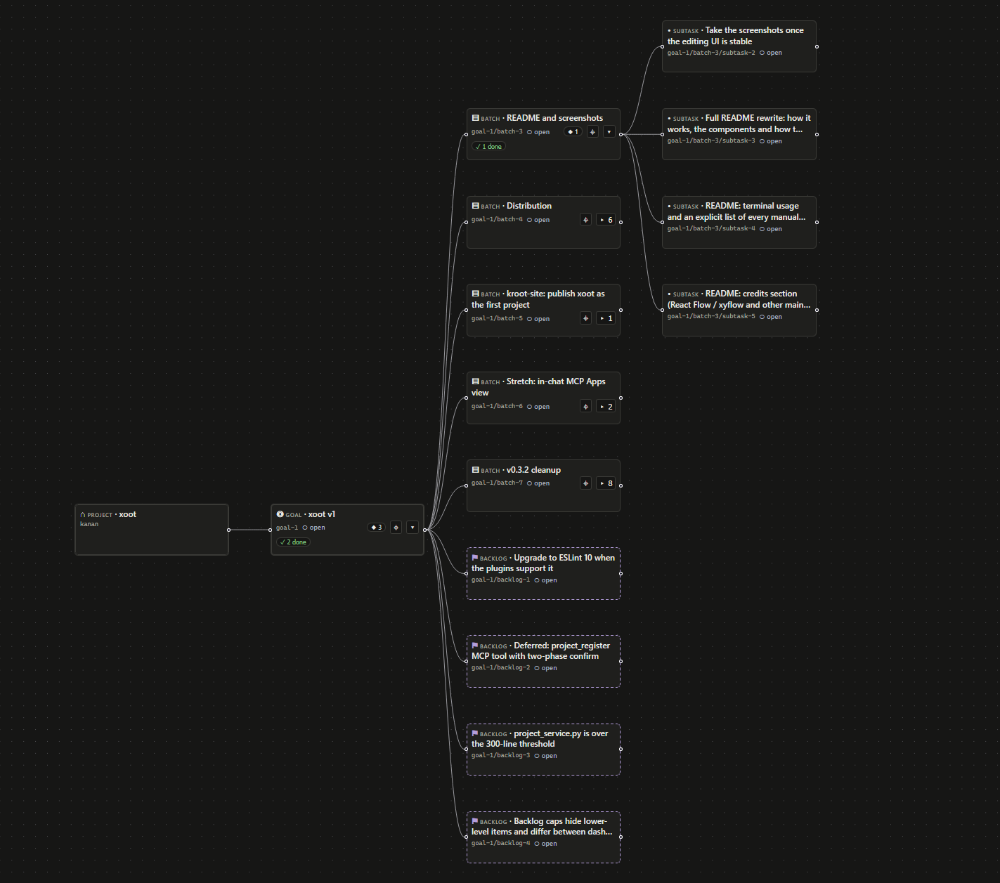
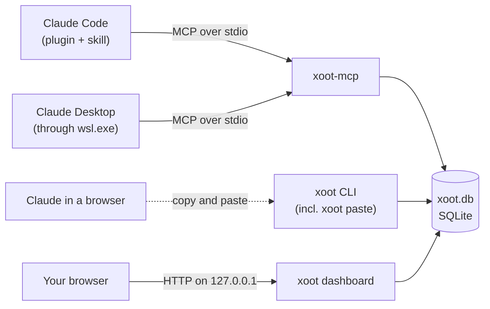
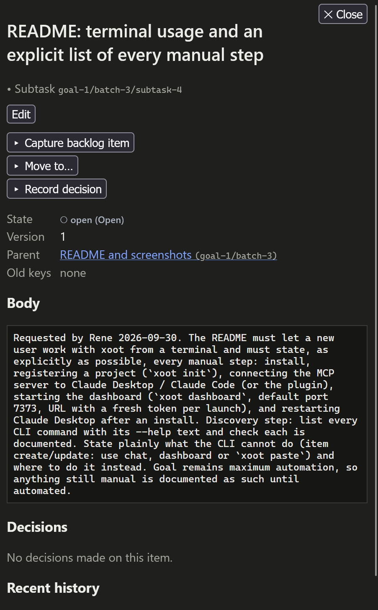
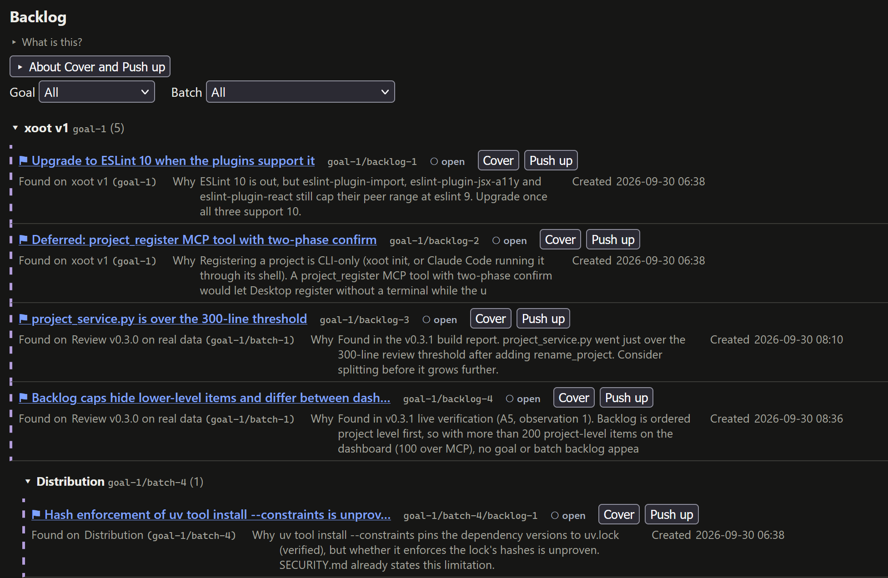
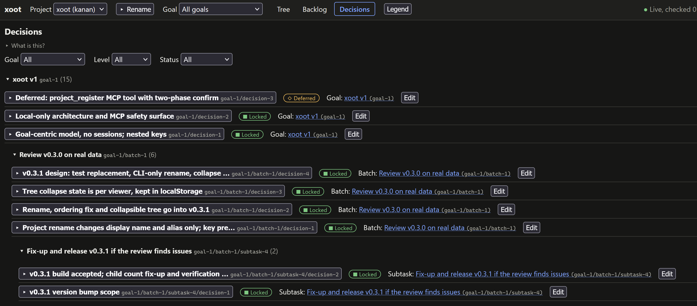
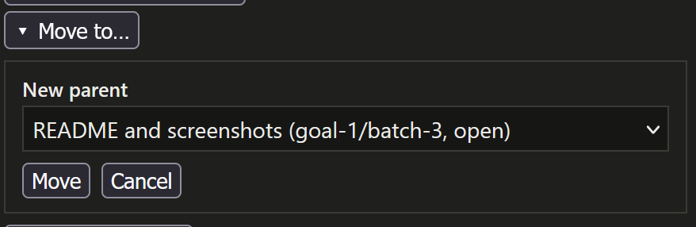

# xoot

Keep goals, batches and subtasks straight across Claude conversations.

The name comes from Mayan, where *xoot* can mean "split".

[](LICENSE)
[](https://github.com/Kanan-Systems/xoot/actions/workflows/backend-gates.yml)

xoot is a local tracker that Claude reads and writes through MCP. Work
belongs to goals, not to conversations, so any number of chats and Claude
Code agents can work on the same goal. Work starts from a brief.
Side work is captured as backlog the moment it shows up, and decisions are
recorded with their rationale. You can see and edit all of it in a local
dashboard.



Status: 1.0.0, the first public release. Changes per release:
[CHANGELOG.md](CHANGELOG.md).

## How the pieces fit



All state is one SQLite file, `xoot.db`. Each Claude client starts the MCP
server, `xoot-mcp`, and talks to it over stdio. The Claude Code plugin adds
the `xoot-workflow` skill on top. The `xoot` CLI registers projects, shows
the tracker, carries changes for chats without MCP (`xoot paste`) and
serves the dashboard. Everything runs on your machine: xoot makes no
outbound network requests, and the dashboard listens on 127.0.0.1 only.

## Requirements

- Linux and Windows with WSL are supported and tested. macOS is untested.
- [uv](https://docs.astral.sh/uv/), and Python 3.12. `install.sh` uses the
  version in `.python-version` (3.12); CI also tests 3.13. No Node: the
  dashboard ships prebuilt.
- WSL only: Claude Desktop reaches the server through `wsl.exe`, and
  `xoot dashboard --open` uses `wslview` (Ubuntu package `wslu`).

## Install

From a clone, check out the latest release tag and run the installer:

```sh
git clone https://github.com/Kanan-Systems/xoot.git
cd xoot
git fetch --tags && git checkout "$(git describe --tags --abbrev=0)"
./install.sh --dry-run     # prints every action, runs none
./install.sh               # --yes installs the Claude Code plugin without asking
xoot --version
```

`install.sh` runs `uv tool install --reinstall` with the Python from
`.python-version` and the versions pinned in `uv.lock`, checks `xoot
--version`, offers the Claude Code plugin (skipped if xoot is already
registered either way) and on WSL prints the Claude Desktop entry. It never
uses sudo, downloads nothing itself and edits no rc or Windows files. Keep
the checkout in place: the plugin marketplace and the uv install point at
it; after moving it, run `install.sh` again. `xoot` and `xoot-mcp` land in
`uv tool dir --bin`; if that is not on your PATH, the installer prints
`warning: <dir> is not on PATH`, and you add it yourself. uv may also
suggest `uv tool update-shell`: that command edits your shell rc files to
add the directory.

Manual alternative, run from the checkout:

```sh
pins=$(mktemp)
uv export --quiet --frozen --no-dev --no-emit-project --format requirements-txt -o "$pins"
uv tool install --reinstall --python "$(cat .python-version)" --constraints "$pins" .; rm -f "$pins"
```

The exported file carries the sha256 hashes from `uv.lock`, but `uv tool
install` (tested with uv 0.9.8) does not check them: it pins versions only.
A constraints file with a changed hash still installs, and uv 0.9.8 has no
`uv tool install` option that enforces them. The versions are pinned; the
downloads are only as trustworthy as the index (PyPI over HTTPS).

## Quick start

A project is one tracked body of work, registered with one or more
directories (`xoot project add-path` adds more), so it is not tied to one
repository. Register it once, from its directory:

```sh
cd ~/code/csvtool
xoot init --prefix csv --name "CSV tool" --alias csv-tool
```

The prefix qualifies the project's keys and never changes: 2-32 lowercase
letters or digits, starting with a letter, no dashes (aliases may have
dashes). Inside a registered directory the CLI and Claude Code resolve the
project; anywhere else, pass the prefix or an alias.

## Using xoot with Claude

Use Claude Code or Claude Desktop when they can reach xoot: the tracker is
read and written live. Use paste mode for Claude in a browser, where there
is no connection and you carry each change across by hand.

### Claude Code

Register xoot once, at user scope, in **one** of these two ways. Registering
it both ways serves every tool twice.

1. **The plugin** (what `install.sh` offers) gives you the MCP server plus
   the `xoot-workflow` skill:

   ```sh
   claude plugin marketplace add --scope user /path/to/xoot
   claude plugin install --scope user xoot@xoot
   ```

   The plugin starts `xoot-mcp` by name, so `uv tool dir --bin` must be on
   the PATH Claude Code starts with.
2. **`claude mcp add`** gives you the server alone, without the skill:

   ```sh
   claude mcp add xoot --scope user -- "$(uv tool dir --bin)/xoot-mcp"
   ```

3. Start Claude Code inside a registered project directory. The project
   resolves from there, so calls need no `project` argument.
4. To check that it works, ask Claude to call `projects_list`. It returns
   your projects and the database file the server uses.

### Claude Desktop

On Windows the server runs inside WSL, and Desktop starts it through
`wsl.exe`.

1. Install xoot inside WSL with `./install.sh`. On WSL it prints the
   `xoot` entry, inside `"mcpServers"`, with your distro name and the
   absolute `xoot-mcp` path.
2. In Claude Desktop, open **Settings > Developer > Edit Config**. If the
   file is empty or holds `{}`, use this complete config, with the distro
   and path `install.sh` printed:

   ```json
   {
     "mcpServers": {
       "xoot": {
         "command": "wsl.exe",
         "args": ["-d", "Ubuntu-24.04", "/home/you/.local/bin/xoot-mcp"]
       }
     }
   }
   ```

   If it already has an `mcpServers` object, add only the `"xoot": {...}`
   entry inside it, with a comma after the entry before it. Do not add a
   second `mcpServers` key.

3. Fully quit Desktop after every config change: end it in Task Manager,
   because closing the window leaves it running. Then start it again.
4. In every Desktop chat, have Claude pass the project (prefix or alias).
   The server's working directory is `/mnt/c/WINDOWS/System32`, which is
   no project's directory.

Two server processes per Desktop launch, on the same database, are normal
([Clients](docs/clients.md) has the measured details).

### Claude in the browser (paste mode)

claude.ai in a browser has no connection to xoot. Paste mode carries each
change across by copy and paste:

1. `xoot paste brief --project csv` prints a brief (at most 16 KiB: the
   workflow, items in flight with versions, recent decisions, the reply
   protocol). Paste it into the chat.
2. Claude answers with at most one fenced `xoot` block. Copy the reply with
   the copy button under the whole message; a code block's own button drops
   the fence lines.
3. `xoot paste apply reply.md` (or `-` for stdin) prints the plan to
   stderr, asks y/N on the terminal (`--yes` without one) and applies the
   whole block in one transaction, or nothing.
4. Paste the `xoot-receipt` block it prints back into the chat, so the next
   block uses current versions.

A block looks like this. `ref` names a record created in the block, and
later ops refer to it as `"$ref"`:

````text
```xoot
{"xoot": 2, "project": "csv", "ops": [
  {"op": "item_create", "ref": "g", "kind": "goal", "title": "CSV export"},
  {"op": "item_create", "ref": "b", "kind": "batch", "title": "Writer", "parent": "$g"},
  {"op": "item_create", "ref": "t", "kind": "subtask", "title": "Quote cells", "parent": "$b"},
  {"op": "item_update", "key": "$t", "changes": {"state": "active"}},
  {"op": "capture", "found_on": "$t", "title": "Handle BOM", "body": "Excel adds one"}
]}
```
````

Limits: 1-100 ops per block, at most 256 KiB per reply. Ops: `item_create`,
`item_update`, `capture`, `backlog_cover`, `backlog_push`,
`decision_record`, `decision_update`. Writes are recorded as `claude`,
client `paste`. On WSL, this alias applies the reply on the Windows
clipboard:

```sh
alias xpaste='powershell.exe -NoProfile -Command "[Console]::OutputEncoding=[Text.Encoding]::UTF8; Get-Clipboard -Raw" | xoot paste apply -'
```

A legacy code page can silently turn "—" into "-" or accents into "?"; the
plan flags it as POSSIBLE ENCODING DAMAGE, so read the titles before y.

## Using xoot from the terminal

> **The CLI cannot create items or change their state or parent.** Do that
> from a chat (MCP), the dashboard, or paste mode.

The everyday commands, with output from a demo project:

```text
$ xoot brief --project csv     # excerpt
Open goals
  key     state  batches      backlog  title
  goal-1  open   0 of 1 done  1        CSV export

$ xoot tree --project csv --all
goal-1                        goal     open (open)      CSV export
  goal-1/batch-1              batch    open (open)      Writer
    goal-1/batch-1/subtask-1  subtask  active (active)  Quote cells
    goal-1/batch-1/backlog-1  backlog  open (open)      Handle BOM
```

```text
$ xoot backlog --project csv          # read-only; --all adds closed, --at KEY narrows
on goal-1 (goal backlog)
  goal-1/backlog-1  open (open)  Document the format  (found on goal-1)
on goal-1/batch-1 (batch backlog)
  goal-1/batch-1/backlog-1  open (open)  Handle BOM  (found on goal-1/batch-1/subtask-1)
```

```sh
xoot project list                                     # every project and the database in use
xoot project rename --project csv --name "CSV toolkit" --yes   # never the prefix
xoot workflow export --project csv -o workflow.toml   # the state names, as TOML
xoot redact goal-1/batch-1/backlog-1 body --project csv   # clears a field and its history
xoot db stats                                         # schema version, sizes, row counts
```

`--db PATH` and `--json` go before the command or after the action: `xoot
--json project list` and `xoot project list --json` work, `xoot project
--json list` is a usage error (exit 2). Commands that remove or rewrite data
ask y/N, and need `--yes` without a terminal; answering anything but y
exits 1. Exit codes: 0 ok, 1 refused, 2 usage, 3 database (or dashboard
port) unavailable. Full reference: [docs/cli.md](docs/cli.md).

Aliases are kept when a project's name changes or is redacted; remove one
that spells the old name with `xoot project remove-alias ALIAS --project
PREFIX`. After `xoot redact <prefix> name`, a warning lists those aliases
with the command for each; none is removed for you.

## Dashboard

```sh
xoot dashboard [--port N] [--open]
```

It serves a web view and editor on 127.0.0.1 (port 7373 unless `--port`
says otherwise), in the foreground until Ctrl+C, and prints one URL:

```text
http://xoot.localhost:7373/?token=<per-launch token>
```

Open it in a browser on the same machine. The token is new at every launch
and is swapped for a cookie on first use; `--open` opens the browser with a
one-time code instead of the token. `xoot dashboard` honours `--db`.

**Tree.** Goals, batches and subtasks with their backlog. Done and dropped
work stays hidden until "Show done and dropped"; focus on a goal or batch,
collapse branches, add a **New goal**. Clicking an item opens its drawer:
edit title, state and body, add the child kind, capture backlog, move a
batch or subtask ("Move to…"), record a decision. To drag, double-click a
batch or subtask to arm it, then drop it on its new parent.



**Backlog.** Open backlog grouped goal > batch, then the project backlog,
filterable by goal and batch. **Cover** turns an item into a subtask in a
batch you choose; **Push up** moves it one level up.



**Decisions.** Decisions grouped goal > batch > subtask, filterable by goal,
level and status. You can record a decision, optionally superseding an
older one, and edit its title, body and status.



A move, a push and a drop of an item with children show what will happen
in plain words and apply only once confirmed. An edit to a record someone
changed meanwhile is refused with what changed; nothing is merged. The
views refresh every two seconds; the project can be renamed (or given an
alias) next to the project switcher.



Security in short: only `xoot.localhost`, `localhost` and `127.0.0.1` on
the served port are answered, every API request needs the per-launch
cookie, and writes also need the dashboard's own Origin. See
[SECURITY.md](SECURITY.md#dashboard).

## Concepts

- A project holds **goals**, goals hold **batches**, batches hold
  **subtasks**. **Backlog** is work found along the way, on a batch, a goal
  or the project.
- Keys are nested paths (`goal-1/batch-2/subtask-3`, `goal-1/backlog-5`);
  a moved item's old key keeps resolving.
- Batches and goals complete on their own once every child is done or
  dropped and no open backlog sits on them, and reopen on new open work.
- Open backlog blocks completion until it is **covered** (becomes a
  subtask), **resolved** (set done) or **pushed up** (batch to goal to
  project).
- **Decisions** (locked, deferred, superseded) belong to the goal, batch or
  subtask they were made on.

Details: [Concepts](docs/concepts.md) and [Workflow](docs/workflow.md).

## Manual steps checklist

What you still do by hand:

- [ ] Install uv; clone xoot, check out the latest tag, run `./install.sh`.
- [ ] Put `uv tool dir --bin` on your PATH if the installer warns.
- [ ] Run `xoot init --prefix <prefix>` once per project directory.
- [ ] Claude Desktop: add the printed entry, then fully quit (Task Manager)
      and restart it.
- [ ] `XDG_DATA_HOME` set: add `"--db", "<path>/xoot/xoot.db"` to Desktop's
      `args`, and start Claude Code from a shell where it is set
      ([Clients](docs/clients.md#environment)).
- [ ] WSL with `xoot dashboard --open`: install `wslu` (for `wslview`), or
      open the printed URL yourself.
- [ ] After every upgrade, restart Claude Code and fully restart Desktop.

## Upgrade, uninstall, data and backups

**Upgrade:** check out the new tag, run `./install.sh` again, then restart
the clients (a running server keeps the code it started with).

A server started before the install keeps running the old code against the
newly migrated database, and its tool calls fail (see
[Troubleshooting](#troubleshooting)). After every upgrade, make sure none is
left:

1. Quit Claude Desktop completely: end it in Task Manager, because closing
   the window leaves it, and the servers it started inside WSL, running.
   Exit every Claude Code session as well.
2. List the servers still running, then compare each one's start time
   with the install time (the time `install.sh` wrote the `xoot-mcp`
   entry point). A server that started before the install is stale:

   ```sh
   pgrep -af xoot-mcp
   ps -o pid,lstart,args -p <pid>
   stat -c '%y' "$(command -v xoot-mcp)"
   ```

3. Stop them all with `pkill -f xoot-mcp`. It also stops the server of
   any Claude Code session that is still open; restart that session
   afterwards.
4. Start the clients again. `pgrep -af xoot-mcp` now lists only servers
   started after the install, and `xoot-mcp --version` prints the version
   they run.

**Migration:** 0.4.0 migrates an existing database to schema version 3 and
first copies it to `xoot.db.pre-v3` beside it (mode 0600; only the newest
such copy is kept). There is no downgrade without that copy: an older xoot
refuses the migrated file with `database schema version 3 is newer than
supported 2`. Databases from xoot 0.2 or earlier are refused and cannot be
upgraded; move the file aside and run `xoot init` again.

**Data:** `$XDG_DATA_HOME/xoot/xoot.db` (default
`~/.local/share/xoot/xoot.db`); `--db PATH` on `xoot` and `xoot-mcp` picks
another file. A new directory gets mode 0700 and a new database 0600. On
every open, a data directory, database, WAL or SHM file that is a symlink,
has another owner or any group/other bit set is refused, never chmod-ed, so
a `--db` inside a shared directory such as `/tmp` fails.

**Backup** through SQLite's backup API, consistent while clients run (needs
`python3` on PATH):

```sh
(umask 077; python3 -c 'import sqlite3, sys; s = sqlite3.connect(sys.argv[1]); d = sqlite3.connect(sys.argv[2]); s.backup(d); d.close(); s.close()' ~/.local/share/xoot/xoot.db ~/xoot-backup.db)
```

To restore, stop every client and the dashboard, remove any `xoot.db-wal`
and `xoot.db-shm`, and copy the backup over `xoot.db` (mode 0600).

**Uninstall:**

```sh
# Claude Code, installed as the plugin:
claude plugin uninstall xoot@xoot
claude plugin marketplace remove xoot
# Claude Code, registered with claude mcp add instead:
claude mcp remove xoot
# Then the tool itself:
uv tool uninstall xoot
```

Also remove `xoot` from Claude Desktop's config. The database is kept:
delete `$XDG_DATA_HOME/xoot/` (default `~/.local/share/xoot/`) or your
`--db` file yourself.

## Troubleshooting

| Symptom | Cause | Fix |
|---|---|---|
| `error: UnsafePathError: refusing to open <path>: it grants group or other permissions (mode 0750)` (exit 3) | The data directory or database is readable by others (or is a symlink, or has another owner) | `chmod 700` the directory and `chmod 600` the database |
| `error: port 7373 is in use; pass --port to choose another` (exit 3) | Another dashboard or program holds the port | `xoot dashboard --port <N>` |
| `warning: could not open a browser; open the URL above` | Under WSL `--open` runs `wslview`, which is missing or failed | Install `wslu`, or open the printed URL |
| xoot tools missing in Claude Code with the plugin | `xoot-mcp` is not on the PATH Claude Code started with | Add `uv tool dir --bin` to PATH and restart Claude Code |
| Claude and the CLI show different projects | `XDG_DATA_HOME` reached one and not the other, so they use different files | Compare `projects_list` with `xoot project list` (both name the database); pass `--db` (see [Clients](docs/clients.md#environment)) |
| A client behaves like the old version after an upgrade | The running server still has the old code loaded | Restart Claude Code; fully quit and restart Desktop |
| xoot tools fail with an error mentioning an enum / stored data after an upgrade (`ValidationError: invalid arguments: * (enum)` from 0.4.0 and older; `StoredDataError: stored data could not be read: ...` or `database schema version N is newer than supported M` from 0.4.1) | A server started before the install still runs the old code and cannot read what the new version wrote | Stop the stale servers as in [Upgrade](#upgrade-uninstall-data-and-backups): quit Desktop completely, `pgrep -af xoot-mcp`, `pkill -f xoot-mcp`, then restart the clients |
| Desktop tool calls fail with `project not resolved; pass project=<alias or prefix>, one of: ...` | Desktop's working directory is no project's directory | Pass the project; `projects_list` shows the choices |
| `this database was created by xoot 0.2 or earlier; ...` | A 0.2 database | Move the file aside, then run `xoot init` again |
| A dragged node in the dashboard tree snaps back where it should move | The drop found no target in this browser | Run `localStorage.setItem('xoot:debug', 'drag')` in the browser console and drop again: each drop logs the node, pointer, viewport, candidates and decision to the console, and nothing leaves the page |

## Credits

The dashboard's tree is drawn with [React Flow](https://reactflow.dev)
(xyflow). These are the direct runtime dependencies, with the licenses
recorded in the installed package metadata and in `package-lock.json`:

| Python | License | JavaScript (dashboard) | License |
|---|---|---|---|
| anyio | MIT | @dagrejs/dagre | MIT |
| mcp | MIT | @tanstack/react-query (TanStack Query) | MIT |
| pydantic | MIT | @xyflow/react (React Flow) | MIT |
| starlette | BSD-3-Clause | react | MIT |
| uvicorn | BSD-3-Clause | react-dom | MIT |
| | | react-router-dom (React Router) | MIT |

Every package xoot ships or runs, transitive ones included, is listed with
its version, license, copyright line and full license text in
[THIRD_PARTY_NOTICES.md](src/xoot/THIRD_PARTY_NOTICES.md), which also ships
inside the installed package. It is generated from `uv.lock`,
`dashboard/package-lock.json` and the installed license files by
`scripts/gen_notices.py`.

## Development

See [CONTRIBUTING.md](CONTRIBUTING.md).

## License

MIT. See [LICENSE](LICENSE).
